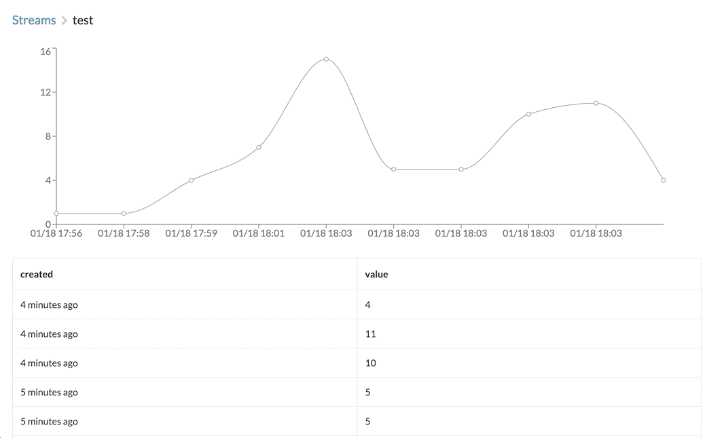

# dlphn-rs

a humble sensor data logger that remembers the data you send it. cause [it's smart][dolphin] and stuff.

the api is written in rust using actix-web. the ui is written in typescript using react and redux.



## install

check the [releases] for a binary build that matches your platform.

in order to build the latest release from source, you will need to use [rustup] to install the rust toolchain, and then run:

```sh
$ cargo install dlphn
```

## run

```sh
$ dlphn

                     ▄▄▄▄▄
                    ▐█████████████▄▄
                        ▀███████████████████████████████▄▄
                          ████████████████████████████████████▄
                         ▐███████████████████████████████████████▄
                        ▄███████████████████████████████████████████
                      ▄██████████████████████████████████████████████
                    ▄█████████████████████████████████████████████████
                   ▄██████████████████████████████████████████████████
                  ████████████████████████████████████████████████████
                 ███████████████████▀▀  ▄██████████████████████████████▄
                ▐██████████████▀       ██████████████▀      ▀▀████████████
                █████████████       ▄██████▀ ███████              ▀▀███████
               ▐███████████                ▄█████▀
               ▐█████████▀                ▐██▀▀
               █████████
               ████████
               ▐██████▌
               ▐██████
                █████▌
               ▄████████▄
             ▄██████████████▄
           ▄██████████████████▄
          █████████████████████▄
         ▐████████▀▀▀
          ▀
                                         dlphn-rs

[dlphn] listening on 127.0.0.1:8080
[dlphn] API docs available at: http://127.0.0.1:8080/api/v1/docs
```

[dolphin]: https://www.nationalgeographic.com/news/2013/8/130806-dolphins-memories-animals-science-longest/
[rustup]: https://rustup.rs/
[releases]: https://github.com/toddtreece/dlphn-rs/releases

## benchmarks

### logging data

~1500 inserts per second via the REST API. results from 2017 intel nuc 3.5GHz i7-7567U kaby lake:

```sh
$ make bench
wrk -t10 -c100 -d 30s -s bench/post.lua http://localhost:8080/api/v1/streams/bench/data
Running 30s test @ http://localhost:8080/api/v1/streams/bench/data
  10 threads and 100 connections
  Thread Stats   Avg      Stdev     Max   +/- Stdev
    Latency    84.69ms  147.65ms   2.00s    96.57%
    Req/Sec   153.37     25.66   262.00     70.56%
  45957 requests in 30.10s, 3.29MB read
  Socket errors: connect 0, read 0, write 0, timeout 41
  Non-2xx or 3xx responses: 1
Requests/sec:   1526.97
Transfer/sec:    111.84KB
```

## license

copyright (c) 2020 todd treece. licensed under the MIT license.
